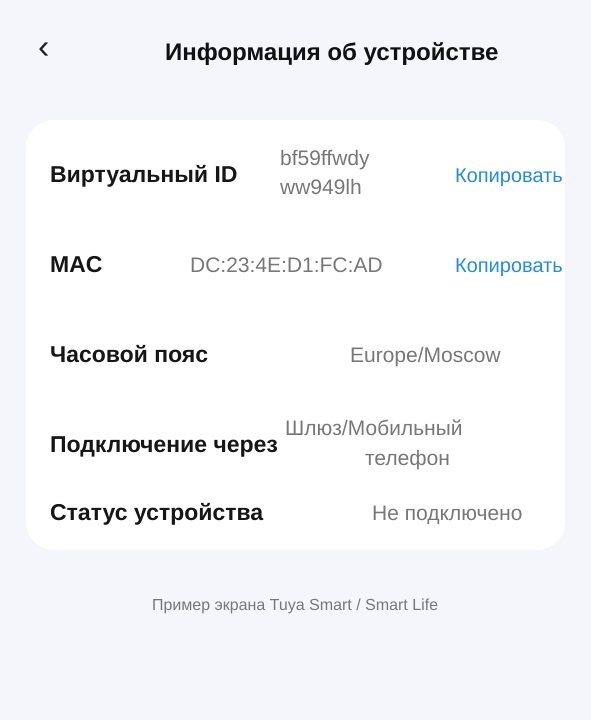

# ESPHome Gimdow BLE

External ESPHome component for direct local BLE control of a **Gimdow A1 PRO MAX** smart lock using the Tuya BLE v3 protocol.

Tested with:
- Gimdow A1 PRO MAX / Tuya product profile `rlyxv7pe`
- ESPHome 2026.9.0
- ESP32 using `ble_client`

## Features

- Direct local BLE lock/unlock
- Tuya BLE v3 session setup and pairing
- Lock command via DP46
- Unlock command via DP6
- Lock-state fallback from DP47
- Optional external binary sensor as the authoritative physical bolt state
- Compatible with `ble_client.auto_connect: false` so a separate physical BLE remote can still access the lock

## Installation

```yaml
external_components:
  - source: github://prokudin07/gimdow_ble
    components: [ gimdow_ble ]
    refresh: 0s
```

## Basic example

```yaml
substitutions:
  # Replace these values with the ones from your own lock.
  gimdow_local_key: "YOUR_LOCAL_KEY"
  gimdow_mac: "AA:BB:CC:DD:EE:FF"
  gimdow_uuid: ${gimdow_uuid}
  gimdow_device_id: "YOUR_TUYA_DEVICE_ID"

esp32_ble_tracker:

ble_client:
  - mac_address: ${gimdow_mac}
    id: gimdow_ble_client
    auto_connect: false

external_components:
  - source: github://prokudin07/gimdow_ble
    components: [ gimdow_ble ]
    refresh: 0s

lock:
  - platform: gimdow_ble
    name: Gimdow
    id: gimdow

    ble_client_id: gimdow_ble_client

    local_key: ${gimdow_local_key}
    uuid: ${gimdow_uuid}
    tuya_device_id: ${gimdow_device_id}
```

## Optional physical bolt-state sensor

If the lock can also be operated by another BLE remote, the Tuya DP state may not always be updated through this ESP32 connection. You can therefore provide an existing ESPHome binary sensor as the authoritative lock state:

```yaml
lock:
  - platform: gimdow_ble
    name: Gimdow
    id: gimdow

    ble_client_id: gimdow_ble_client
    local_key: ${gimdow_local_key}
    uuid: ${gimdow_uuid}
    tuya_device_id: ${gimdow_device_id}

    state_sensor: Lock_sensor
```

For the current implementation:
- external sensor `ON` = unlocked
- external sensor `OFF` = locked

When `state_sensor` is configured, DP47 and optimistic command-state publishing do not overwrite the external physical state.

## BLE connection mode

If you also use the original physical BLE remote, use:

```yaml
auto_connect: false
```

The component will connect on demand when Home Assistant sends a lock/unlock command.

If the ESP32 is the only BLE controller and minimum latency matters, `auto_connect: true` can be used, but it may prevent another BLE remote from connecting while the ESP32 holds the connection.

## Required Tuya values

The component requires four device-specific values:

| ESPHome option | What it is | Where to get it |
|---|---|---|
| `mac_address` / `gimdow_mac` | BLE MAC address of the lock | Tuya Smart / Smart Life app → device information |
| `tuya_device_id` | Tuya device ID | In the mobile app this is shown as **Virtual ID** |
| `uuid` | Tuya BLE UUID used during pairing | Tuya cloud device information / API |
| `local_key` | Local Tuya encryption key | Tuya cloud device information / API |

### 1. BLE MAC address and Tuya device ID from the mobile app

The easiest two values can be read directly from the **Tuya Smart / Smart Life** application.

Open the lock and go to its device information page. Depending on the application version, the menu may be named **Device Information**, **Device Info** or similar.

Look for:

- **MAC** — use this as the ESPHome BLE address.
- **Virtual ID** — use this as `tuya_device_id`.



Example:

```text
Virtual ID: bf59ffwdyww949lh
MAC:        DC:23:4E:D1:FC:AD
```

ESPHome:

```yaml
substitutions:
  gimdow_mac: "DC:23:4E:D1:FC:AD"

ble_client:
  - mac_address: ${gimdow_mac}
    id: gimdow_ble_client
    auto_connect: false

lock:
  - platform: gimdow_ble
    ...
    tuya_device_id: "bf59ffwdyww949lh"
```

> The values above are only an example. Use the values shown for your own lock.

### 2. Getting UUID and local_key from Tuya IoT Platform

The mobile application normally does not display `uuid` or `local_key`. They can be obtained through a Tuya cloud project linked to the same Tuya Smart / Smart Life account.

General procedure:

1. Sign in to **Tuya IoT Platform**.
2. Create or open a Cloud project.
3. Link the mobile-app account that contains the lock.
4. Open the list of linked devices.
5. Find the Gimdow lock by its **Virtual ID / Device ID**.
6. Open the device details or query the device through the Tuya API.
7. Record:
   - device ID
   - UUID
   - local key
   - MAC address, if shown

For the tested lock the values have this form:

```text
Device ID:  bf59ffwdyww949lh
UUID:       3fcb877db8ad5e04
Local key:  <device-specific secret>
MAC:        DC:23:4E:D1:FC:AD
```

Do not copy these example identifiers to another lock. Every device has its own values.

### 3. Getting local_key with TinyTuya

If you prefer not to copy values manually from the Tuya web interface, **TinyTuya** can query the Tuya cloud account and produce a device list containing identifiers and local keys.

Typical workflow:

```bash
python3 -m venv venv
source venv/bin/activate
pip install tinytuya
python -m tinytuya wizard
```

The wizard asks for Tuya cloud project credentials and then retrieves the devices linked to that project.

Find the record matching the lock's **Virtual ID / Device ID** and copy its `local_key`.

TinyTuya still uses the Tuya cloud API, so the Tuya account/cloud project must be linked correctly.

### 4. Store local_key as a secret

Do **not** publish the real `local_key` in GitHub or a public YAML file.

Recommended ESPHome configuration:

```yaml
# secrets.yaml
gimdow_local_key: "YOUR_REAL_LOCAL_KEY"
```

and:

```yaml
substitutions:
  gimdow_local_key: !secret gimdow_local_key
```

Then use it in the component:

```yaml
lock:
  - platform: gimdow_ble
    name: Gimdow
    id: gimdow

    ble_client_id: gimdow_ble_client

    local_key: ${gimdow_local_key}
    uuid: ${gimdow_uuid}
    tuya_device_id: ${gimdow_device_id}
```

## Status

This is an experimental external component developed and tested against a specific Gimdow A1 PRO MAX / `rlyxv7pe` lock. Other Tuya BLE locks may use different datapoints or protocol behavior.
